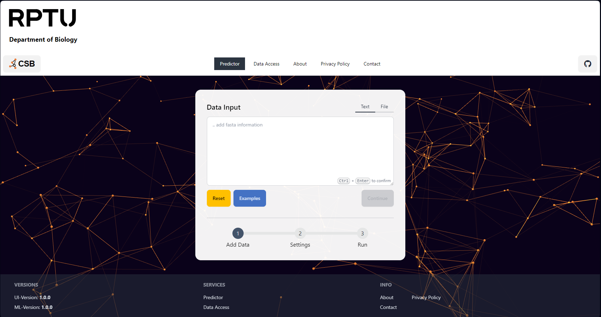
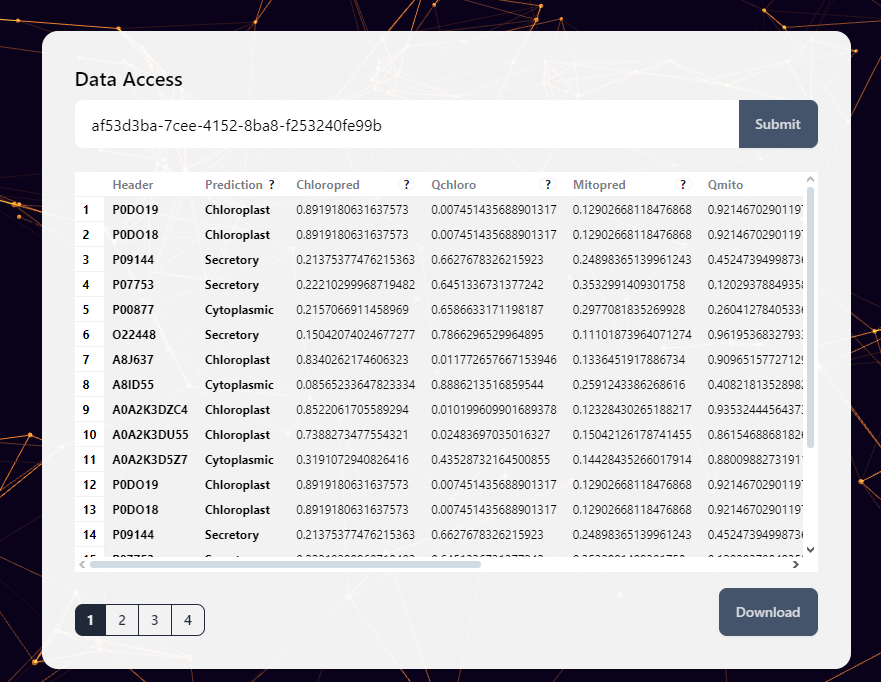
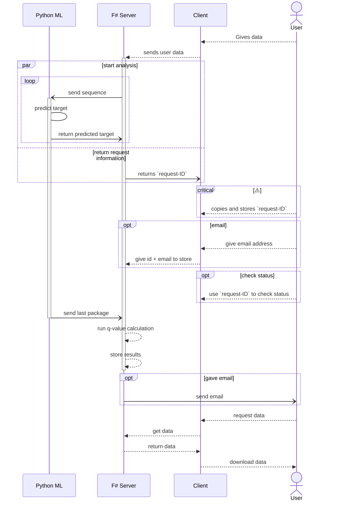

# ChlamyAtlas

A web UI for optimised versions of the models published in Wang et al. 2023.



# Supported formats

ChlamyAtlas expects input in either the FASTA format or as pure amino acid sequence.
The FASTA format consists of two building blocks. The first is a description which explains the following sequence. This description starts with ">" and is written in a single line. The amino acid sequence follows in the next line and can span multiple lines. An example for this format is:
```
>sp|A0A178WF56|CSTM3_ARATH Protein CYSTEINE-RICH TRANSMEMBRANE MODULE 3 OS=Arabidopsis thaliana OX=3702 GN=CYSTM3 PE=1 SV=1
MAQYHQQHEMKQTMAETQYVTAPPPMGYPVMMKDSPQTVQPPHEGQSKGSGGFLRGCLAA
MCCCCVLDCVF
>sp|A1YKT1|TCP18_ARATH Transcription factor TCP18 OS=Arabidopsis thaliana OX=3702 GN=TCP18 PE=1 SV=1
MNNNIFSTTTTINDDYMLFPYNDHYSSQPLLPFSPSSSINDILIHSTSNTSNNHLDHHHQ
FQQPSPFSHFEFAPDCALLTSFHPENNGHDDNQTIPNDNHHPSLHFPLNNTIVEQPTEPS
ETINLIEDSQRISTSQDPKMKKAKKPSRTDRHSKIKTAKGTRDRRMRLSLDVAKELFGLQ
DMLGFDKASKTVEWLLTQAKPEIIKIATTLSHHGCFSSGDESHIRPVLGSMDTSSDLCEL
ASMWTVDDRGSNTNTTETRGNKVDGRSMRGKRKRPEPRTPILKKLSKEERAKARERAKGR
TMEKMMMKMKGRSQLVKVVEEDAHDHGEIIKNNNRSQVNRSSFEMTHCEDKIEELCKNDR
FAVCNEFIMNKKDHISNESYDLVNYKPNSSFPVINHHRSQGAANSIEQHQFTDLHYSFGA
KPRDLMHNYQNMY
```

ChlamyAtlas was developed with the assumption that the description follows the standard used by the Universal Protein Resource ([Uniprot](https://www.uniprot.org/)) and only returns the Uniprot ID as description in the output table. This can be circumvented by removing the "|" in the description. In this case the complete description gets returned.

The only other supported format are pure amino acid sequences. An example for this format is:
```
MAQYHQQHEMKQTMAETQYVTAPPPMGYPVMMKDSPQTVQPPHEGQSKGSGGFLRGCLAA
MCCCCVLDCVF
```
This format can only be used for a single amino acid sequence. Multiple amino acid sequences must be in the following format:
```
>!MAQYHQQHEMKQTMAETQYVTAPPPMGYPVMMKDSPQTVQPPHEGQSKGSGGFLRGCLAA
MCCCCVLDCVF
>!MNNNIFSTTTTINDDYMLFPYNDHYSSQPLLPFSPSSSINDILIHSTSNTSNNHLDHHHQ
FQQPSPFSHFEFAPDCALLTSFHPENNGHDDNQTIPNDNHHPSLHFPLNNTIVEQPTEPS
ETINLIEDSQRISTSQDPKMKKAKKPSRTDRHSKIKTAKGTRDRRMRLSLDVAKELFGLQ
DMLGFDKASKTVEWLLTQAKPEIIKIATTLSHHGCFSSGDESHIRPVLGSMDTSSDLCEL
ASMWTVDDRGSNTNTTETRGNKVDGRSMRGKRKRPEPRTPILKKLSKEERAKARERAKGR
TMEKMMMKMKGRSQLVKVVEEDAHDHGEIIKNNNRSQVNRSSFEMTHCEDKIEELCKNDR
FAVCNEFIMNKKDHISNESYDLVNYKPNSSFPVINHHRSQGAANSIEQHQFTDLHYSFGA
KPRDLMHNYQNMY
```

# Result



Explanations of Chloropred ,Qchloro, Mitopred,Qmito,Secrpred,Qsecr, and FinalPred.

### Chloropred

Prediction score indicating the likelihood of the protein being localized to the Chloroplast. A higher scores suggest a stronger prediction that the protein is localized in the Chloroplast.

### Qchloro

q-value associated with the Chloroplast prediction score. Provides a measure of statistical significance for the Chloroplast prediction. Lower q-values indicate higher statistical significance.

### Mitopred
Prediction score for the localization of the protein to the Mitochondria. A higher scores suggest a stronger prediction of Mitochondrial localization.

### Qmito
q-value associated with the Mitochondria prediction score. Indicates the statistical significance of the Mitochondria localization prediction. Lower q-values suggest a more reliable prediction.

### Secrpred
Prediction score for identifying the protein as a Secretory Protein.A higher scores indicate a stronger likelihood that the protein functions as a Secretory Protein.

### Qsecr
q-value for the Secretory Protein prediction. Provides a measure of the statistical significance of the Secretory Protein prediction. Lower q-values are indicative of more statistically significant predictions.

### FinalPred
Represents the model's final prediction of the protein's localization based on the highest score and its corresponding q-value. The final localization is determined by comparing the q-values and prediction scores against preset cutoffs. If all q-values exceed the cutoff, the protein is classified as "Cytoplasmic."

### Cutoff
The threshold q-value below which a prediction is considered statistically significant. Set to 0.05 by default, meaning that predictions with q-values below this threshold are classified as significant. This parameter helps in distinguishing between statistically significant and non-significant predictions, reducing the chance of false-positive localizations.


# Docker

## Environment Variables

- **NET_EMAIL_EMAIL**: Email address to send emails from

  Default: Set via user secrets

- **NET_EMAIL_ACCOUNTNAME**: Email account name to send emails from

    Default: Set via user secrets

- **NET_EMAIL_PASSWORD**: Email account password to send emails from

    Default: Set via user secrets

- **NET_EMAIL_SERVER**: Email server to send emails from

    Default: Set via user secrets

- **NET_EMAIL_PORT**: Email server port to send emails from

    Default: Set via user secrets

- **PYTHON_SERVICE_TIMEOUT**: Time in minutes before conenction timeout between ui and api service

    Default: 30 minutes

- **PYTHON_SERVICE_URL**: Sets the url for the api predictor backend.

    Default: `http://localhost:8000`

    *Remarks:* In docker compose this could be `http://host.docker.internal:8000`

    *Remarks:* On Linux might require:

    ```
    extra_hosts:
        - "host.docker.internal:host-gateway"
    ```

- **PYTHON_SERVICE_STORAGE_TIMESPAN**: How long the user data should be stored

    Default: 1 Hour

## Docker Compose

```yaml
version: '3.7'

name: chlamyatlas

services:
  api:
    image: csbdocker/chlamyatlas-api:latest
    ports:
      - 8000:80
    environment:
      GUNICORN_CMD_ARGS: "-k uvicorn.workers.UvicornWorker --preload"
      MAX_WORKERS: "4"
      TIMEOUT: "0"
  ui:
    image: csbdocker/chlamyatlas-ui:latest
    environment:
      PYTHON_SERVICE_URL: "http://host.docker.internal:8000"
      PYTHON_SERVICE_STORAGE_TIMESPAN: "7"
    ports:
      - 5000:5000
    # Use this to make host.docker.internal accessible on linux docker
    extra_hosts:
     - "host.docker.internal:host-gateway"
```

# Local Development

## Install pre-requisites

You'll need to install the following pre-requisites in order to build SAFE applications

* [.NET SDK](https://www.microsoft.com/net/download) 8.0 or higher
* [Node 18](https://nodejs.org/en/download/) or higher
* [NPM 9](https://www.npmjs.com/package/npm) or higher
* [Python 3.11](https://www.python.org/downloads/) or higher

## Install

- run `setup.cmd`

.. __or__ ..

1. `dotnet tool restore`
2. `py -m venv .venv`
3. `.\.venv\Scripts\python.exe -m pip install -r .\src\FastAPI\requirements.txt`

## Run

- `.\build.cmd run` starts SAFE stack

plus in another terminal run:

1. activate local python environment: `.\.venv\Scripts\Activate.ps1`
2. navigate to fastapi folder: `cd .\src\FastAPI\`
3. start fastapi backend: `./run.cmd`

## Activate Email notification (optional)

Set user-secrets in the following schema:

```json
{
  "email": {
    "NET_EMAIL_EMAIL": "placeholder@mail.de",
    "NET_EMAIL_ACCOUNTNAME": "PlaceholderAccountName",
    "NET_EMAIL_PASSWORD": "HelloWorld1234",
    "NET_EMAIL_SERVER": "smtp.placeholdermail.de",
    "NET_EMAIL_PORT": 587
  }
}
```

## Publish

### Test Publish

1. `.\build.cmd dockerbundle [--uionly]`, creates `:new` docker image(s). Skip fastapi image with `--uionly`
2. `.\build.cmd dockertest`, uses local docker-compose file to start `:new` images.

### To docker-hub

1. Login to CSB-Docker
2. Ensure correct Versions, both for python and dotnet service.
    - `.\build.cmd versions`
    - *Remarks:* Versions are defined in project files. Paths can be found in build project `ProjectInfo.fs`. Accessed via regex parsing.
3. Run `Test Publish` steps. The following step requires built `:new` images.
4. `.\build.cmd dockerpublish`

# Request Workflow


